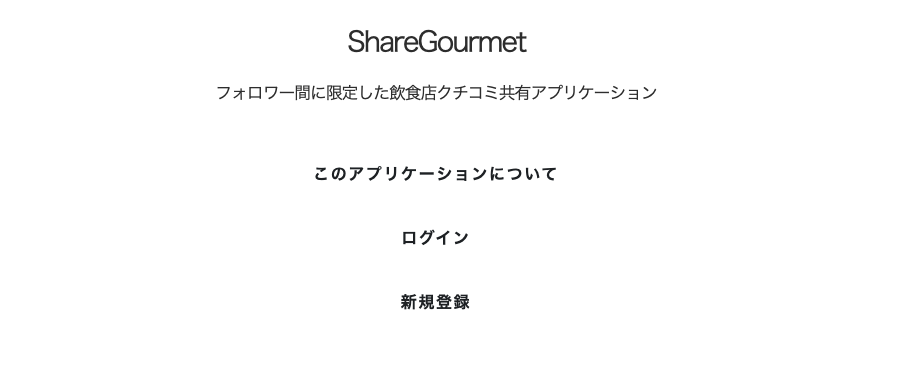
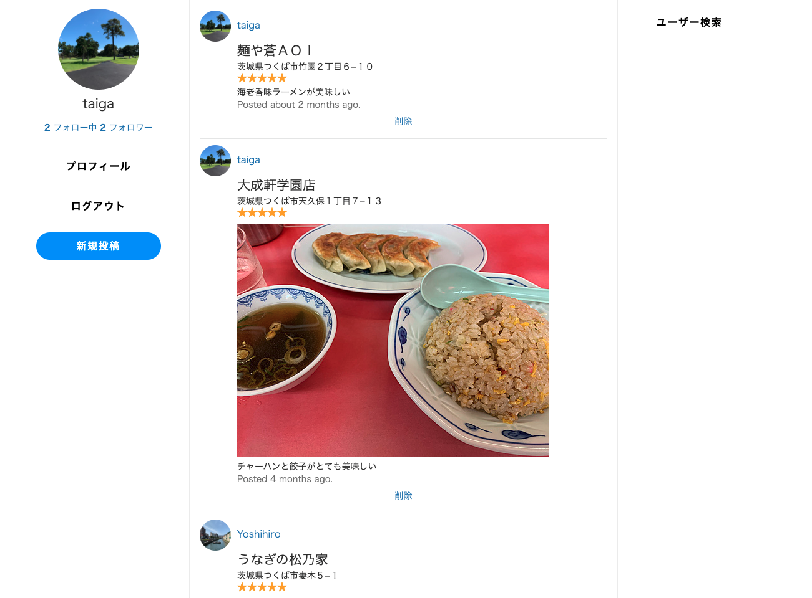

# Share Groumet

### URL
[share-gourmet.com](https://share-gourmet.com)(停止中)

### アプリケーションの概要
現状の多くの飲食店の口コミ共有アプリケーションは多くの情報がある点がメリッ トですが、投稿者がどのような人なのか分からず、多数の口コミの中から適切な情報の取 捨選択が必要になる点がデメリットであると考えています。一方でShareGroumeは、友人等のフォローしている人に限定して口コミの共有を行うため、投稿者の性格や特徴を踏まえた上で口コミを参考にすることができます。

### 仕様
開発環境 Docker  
言語 Ruby  
フレームワーク Ruby on Rails 6  
Appサーバー Puma  
Webサーバー　Nginx  
DB MySQL
本番環境 AWS EC2
飲食店検索機能  [Yahoo!ローカルサーチAPI](https://developer.yahoo.co.jp/webapi/map/openlocalplatform/v1/localsearch.html)